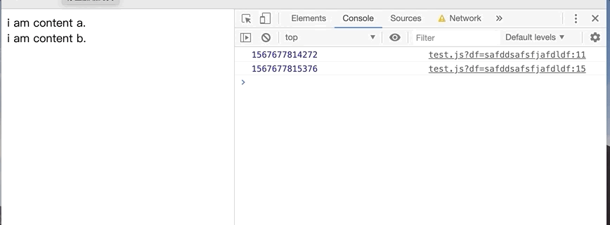
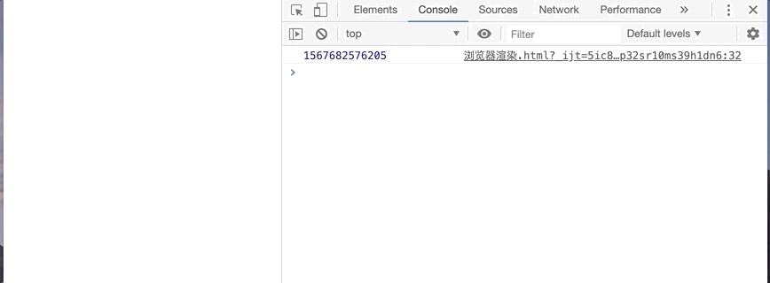
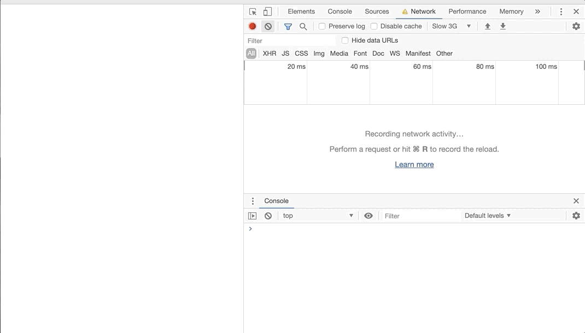

## `<script>`和`<link>`标签对DOM解析和渲染的影响
之前也看过一些关于`<script>`标签和`<link>`标签对DOM树解析和渲染影响的文章，但总感觉似是而非，没有很深刻的理解。趁今天有点空闲，做个尽量全面的总结，并手动撸几个例子，加深下记忆。

### `<script>`标签会阻塞DOM解析和渲染

大家知道`<script>`标签的**加载**、**解析**和**运行**都会**阻塞DOM的解析和渲染**。这是因为js可以操作DOM，浏览器为了防止渲染过程出现不可预期的结果，让GUI渲染线程和js引擎线程互斥，即解析器在遇到`<script>` 标记时会立即解析并执行脚本，文档的解析将停止，直到脚本执行完毕，如果脚本是外部的，那么解析过程会停止，直到从网络同步抓取资源完成后再继续。

`<script>`标签会阻塞DOM的解析，如下代码我们会获取不到页面元素：

```
<html>
<head>
    <tilte>title</title>
</head>
<body>
    <!-- 不管inline或引入的script获取此标签之后的元素是获取不到的 -->
    <script>
        let div = document.querySelector('div');
        console.log(div); // null
    </script>
    <div>
        i am content.
    </div>
</body>
</html>
```

既然`<script>`标签都阻塞DOM的解析了，那肯定也会阻塞页面的渲染，这是毋庸置疑的。

##### `<script>`标签触发Paint
阻塞渲染并不是页面不渲染，如果页面非要等到js加载执行完毕之后再渲染，那用户等待时间也太长了。浏览器的设计肯定会尽早让用户看到页面，因此遇到`<script>`标签时，会触发一次Paint，浏览器会将`<script>`标签之前的元素渲染出来。

并不是所有的`<script>`标签都会触发Paint。
- `<head>`中的`<script>`标签是不会触发的，毕竟此时`<body>`还没有解析，触发Paint也看不到任何内容。
- inline 的 `<script>`也不会触发Paint。

因此，建议`<script>`标签放在`</body>`结束标签之前，这样不会不会阻塞页面整体内容的DOM解析和渲染。但如果页面中只有inline的`<script>`标签，那么放在任何位置对页面的渲染影响都是一样的。

```
<html>
<head>
    <tilte>title</title>
</head>
<body>
    <div>
        i am content a.
    </div>
    
    // test.js中使用大循环延长js执行时间
    <script src='test.js'></script>
    
    <div>
        i am content b.
    </div>
</body>
</html>
```
test.js
```
console.log(Date.now());
for (let i=0; i<2000000000; i++) {
    let a = i;
}
console.log(Date.now());
```
结果如下图：


先展示第一个div，等js加载并运行完毕后，再展示第二个div；

如果将引入的js写成inline形式。如下：
```
<html>
<head>
    <tilte>title</title>
</head>
<body>
    <div>
        i am content a.
    </div>
    
    <script>
        console.log(Date.now());
        for (let i=0; i<5000000000; i++) {
            let a = i;
        }
        console.log(Date.now());
    </script>
    
    <div>
        i am content b.
    </div>
</body>
</html>
```
结果如下：

此时，会等js运行完毕之后，两个div一起显示。inline的`<script>`标签不会触发Paint。

> `<script>`标签会阻塞DOM解析和渲染，但在阻塞同时，其他线程会解析文档的其余部分（预解析），找出并加载需要通过网络加载的其他资源。通过这种方式，资源可以在并行连接上加载，从而提高总体速度。预解析不会修改解析出来的 DOM 树，只会解析外部资源（例如外部脚本、样式表和图片）的引用。


#### `<link>`标签不会阻塞DOM解析但会阻塞DOM渲染
DOM的解析和CSSOM的解析是一个并行的过程。两者互不影响。两者解析完成之后，会合并生成rending tree，之后就是layout和paint阶段，渲染到页面中。

```
<html>
<head>
    <tilte>title</title>
    <script>
        setTimeout(() => {
            console.log(document.querySelectAll('div'));
        }, 0);
        document.addEventListener('DOMContentLoaded', () => {
            console.log('dom parse done');
        })
    </script>
    <link rel="stylesheet" href="https://stackpath.bootstrapcdn.com/bootstrap/4.3.1/css/bootstrap.css">
</head>
<body>
    <div>
        i am content a.
    </div>
    <div>
        i am content b.
    </div>
</body>
</html>
```
结果如下图：


js运行打印‘dom parse done’，且能正常打印出div，但此时页面还未将div渲染出来。因此`<link>`标签并不阻塞DOM的解析，但会阻塞DOM的渲染。

> `<link>`标签并不会像带scr属性的`<script>`标签一样会触发页面paint。浏览器并行解析生成DOM Tree 和 CSSOM Tree，当两者都解析完毕，才会生成rending tree，页面才会渲染。所以应尽量减小引入样式文件的大小，提高首屏展示速度。

#### `<link>`标签会阻塞js的执行

js运行时，有可能会请求样式信息，如果此时还没有加载和解析样式，js就有可能会得到错误的回复，产生很多问题。因此浏览器在`<link>`标签的加载和解析过程中，会禁止脚本运行。
```
<html>
<head>
    <tilte>title</title>
    <script>
        console.log(Date.now());
    </script>
    <link rel="stylesheet" href="https://stackpath.bootstrapcdn.com/bootstrap/4.3.1/css/bootstrap.css">
    <script>
        console.log(Date.now());
    </script>
</head>
<body>
    <div>
        i am content a.
    </div>
    <div>
        i am content b.
    </div>
</body>
</html>
```
结果如下：


两次打印时间相差几秒，`<link>`标签之后的js是在样式下载完成之后才执行的。

再看一个例子：
```
<html>
<head>
    <tilte>title</title>
    <!--大文件，加载时间长-->
    <link rel="stylesheet" href="index.css">
</head>
<body>
    <div>
        i am content a.
    </div>
    <!--js小文件，加载时间短-->
    <script src='test.js'></script>
    <div>
        i am content b.
    </div>
</body>
</html>
```
test.js（小文件，加载时间短）
```
console.log('test');
```
结果如下：


我们知道带src属性的`<script>`标签会触发页面paint，但很显然，此时页面是在样式加载完成之后才渲染到页面的。因此`<script>`标签在样式未加载完成时，也无法触发页面paint（如果js加载时间长，会正常触发页面paint）。

如果把`<link>`标签放在`<script>`标签之后，则`<script>`标签同样能正常触发paint。大家可以自己试一下。

#### 结论
- `<script>`标签会阻塞DOM的解析和渲染；
- 带src属性的`<script>`标签会触发页面paint，渲染此`<script>`标签之前的元素，但也有一定的条件：
    - 此`<script>`标签是在`<body>`中的，`<head>`中的不会触发paint；
    - 此`<script>`标签之前的`<link>`标签需加载完毕。
- inline的`<script>`标签不会触发页面paint，页面必须等到脚本执行完毕，且DOM Tree和CSSOM Tree解析完毕后才会渲染；
- `<link>`标签不会阻塞DOM的解析；
- `<link>`标签会则色DOM的渲染；
- `<link>`标签同时还会阻塞其之后的`<script>`标签的执行。